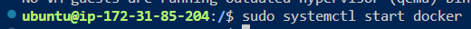

# 2048
Repositorio para el juego de 2048
## Antes de la práctica del 2048, instalación del docker y configuración - Primera parte.
- Para realizarla vamos a utilizar una instación de aws, en la cual vamos a instalar el docker con el comando ``` sudo apt get install docker.io```

- Para poder utilizar el docker compose también hay que instalar el docker compose con el comando ``` sudo apt install docker-compose ```


- Lo siguiente será habilitar el servico de docker hay que utilizar el siguiente comando ``` sudo systemctl enable docker```


- Para inicializar el servico de docker utilizamos el comando de ``` sudo systemctl start docker ```


- Vamos a agregar al usuario ubuntu al grupo de docker sin neesidad de poner el sudo y poder tener los permisos del grupo docker, se hace con el comando ``` sudo usermod -aG docker ubuntu```


- Para poder utilizar los privilegios de grupo docker vamos a utilizar el comando ``` newgrp docker ```
- Para poder descargar la imagen de ubuntu con el comando ``` docker pull ubuntu```


- Vamos a crear el contenedor con el comando de ```docker run -it ubuntu```


- Para levantar el docker run con la imagen de http será con el siguiente comando ``` docker run -d -rm -p 80:80 http```


- Para levantar el docker run con la imagen de nginx será con el siguiente comando ``` docker run -d -rm -p 81:80 nginx```


- Para poder utilizar el nginx en el puerto que hemos puesto que el 81 debemos abrir el  puerto de la maquina.


- El siguiente comando ``` docker run -d --rm -p 80:80 -v ./src:/usr/local/apache2/htdocs/ httpd ``` lo que hará es crear un contenedor con el apache http y con el modificación de - v es para montar en el directorio ./src del host en el puerto 80 del contenedor.  **IMPORTANTE** 
Hay que creada en la maquina el directorio donde se va a montar en este caso es la carpeta de src


## Como crear images - Segunda parte
### Para la segunda parte de esta práctica hemos creado una imagen de un programa sencillo de hola mundo.

- Hacemos el dockerfile con las siguientes instrucciones: 
``` 
FROM ubuntu:23.04

WORKDIR /root

RUN echo "hola mundo" > hello.txt

CMD ["cat", "/root/hello.txt" ]
``` 
FROM: es la imagen de base para poder crear la imagen nueva que en este caso es de ubuntu 23.04
WORKDIR: indica el directorio de trabajo dentro del contedor que este caso será el directorio /root
RUN: La instrucción para ejecutar los comandos que pongamos a continuación, que en este caso es el comando echo que devuelve hola mundo que se vuelca a un archivo llamado hello.txt
CMD: Aqui se ponen las instrucciones que va a ejecutar el contenedor cuando se inicie, que este caso será el comando cat /root/hello.txt se ejecutará, lo que mostrará el contenido del archivo hello.txt.
;

- Una vez creado el dockerfile será crear la imagen con el comando ``` docker build -t hello . ```
;

- Para ver si se ha creado la imagen se usa el comando ``` docker images```
;

- Para ejecutar la imagen se hace con el comando ``` docker run -it hello```
;

## Tercera parte crear un docker file para el juego de 2048
- Se creará un dockerfile para poder crear una imagen del juego de 2048 para ello utilizaremos de base una imagen de nginx para crear la nueva, el directorio de trabajo sera la carpeta del /usr/share/nginx/html , tiene varios run , uno para instakar el git y otro para poder descomprimir y por ultimo elimina archivos del directorio de /var/lib/apt/lists/* y con la instrucción de *EXPOSE 80* significa que los servicios de este contenedor estan abiertos al toda la red si se accede por el puerto 80 desde fuera del contenedor.
```
FROM nginx
WORKDIR /usr/share/nginx/html
RUN apt update \
    && apt install git -y \
    && git clone https://github.com/josejuansanchez/2048.git \
    && rm -rf /var/lib/apt/lists/*
EXPOSE 80 
```  
- Se haran  los mismos pasos que la parte anterior que sera crear la imagen y arrancar el contenedor con los comandos ``` docker build -t 2048 . ```  y ```docker run -it 2048 ``` respectivamente.

- Y ahora se podrá acceder desde la ip de la instancia:80/2048 y ya accederémos al juego.

## Cuarta parte, subir las imagenes que creamos a dockerhub.

- Modificamos un poco el dockerfile del punto anterior añadiendole una lina mas quw seá la ```CMD ["nginx", "-g", "daemon off;"]  ```  que basicamente cuando se inicia un contenedor basado en la imagen que se construye a partir de este Dockerfile, el servidor Nginx se iniciará y se ejecutará en primer plano.
;

- Volvemos a crear la imagen del dockerfile pero al crearlo hay que poner el nombre de usuario del docker hub delante del nombre de la imagen que hemos elegido para el nombre, con el comando ``` docker build -t noeliagp/2048 . ```  y creamos otra version que será poniendo lo mismo pero el nombre trendrá :x.x que será los números de la versión. ``` docker build -t noeliagp/2048:1.0 . ``` 
;
;
- Vemos si se ha creado con el comando ``` docker images ```

- Procedemos a iniciar ssesión en docker hub con el comando ``` docker login```	, donde pondremos el nombre de usuario y la contraseña, en otros casos si no tiene la contraseña tiene que poner un token. 


- Para poder subir la imagen a dockerhub es con el comando ``` docker push noeliagp/2048:latest ```


## Quinta parte integración continua.
- Por último en esta práctica lo que hemos hecho es la integración continua, que es que cada vez que en nuestro proyecto de github se haga un commit automaticamente se va a realizar una imagen en docker hub y despues se irá actualizando.

- Lo primero será hacer un repositorio en github para nuestro proyecto.


- Dentro de nuestro reposotorio será ir a las opciones de actions de la barra superior y dentro de este, eligiremos la opcion de *Publish docker Container* y pinchamos a configurar.


- Se nos crea una carpeta de flujos de trabajo que dentro tiene un archivo llamado docker-publish.yml el cual modificaremos para poder que haga el creación de la imagen, cada vez que hacemos un commit y con los datos del usuario que estan en variables que crearemos en el paso siguente.


- Para las variables de secrets, se crean en el apartado de settings del repositorio, dentro del secrets and variables , actions y hay que crear nuevos repositorios con el mismo nombre que le hemos puesto a las variables en el archivo  docker-publish.yml


- En el momento que se haga un commit en el apartado de activo se ven los espacios de trabajo.


- Si se selecciona uno de los elementos se puede ver los pasos que realiza.


- Asi se vería en el dockerhub.
-

